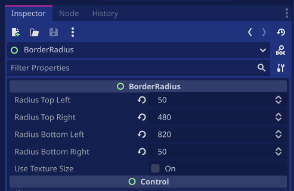

# Border radius for Godot 4

This is a border radius shader and a tool script for Godot 4.


## How to use?

Add a `BorderRadius` node into your node that you want to add border radius:


find `BorderRadius` and add:


and set your borders:



### Use with textures (`TextureRect`)

You can enable/disable "Use Texture Size" (`use_texture_size`) property to use actual texture size instead of rect size with `TextureRect`.

### How to use the shader directly?

If you wanna use the border radius shader directly attach it to your node and set following uniforms:

```gdscript
shader_material.set_shader_parameter("canvas_width", size.x)
shader_material.set_shader_parameter("canvas_height", size.y)

shader_material.set_shader_parameter("radius_top_left", radius_top_left)
shader_material.set_shader_parameter("radius_top_right", radius_top_right)
shader_material.set_shader_parameter("radius_bottom_left", radius_bottom_left)
shader_material.set_shader_parameter("radius_bottom_right", radius_bottom_right)
```

The shader is here:

```glsl
/*
 * Pixel-sized Border Radius Shader
 * Copyright (C) 2023 Oğuzhan Eroğlu <meowingcate@gmail.com> (https://oguzhaneroglu.com)
 */

shader_type canvas_item;

uniform float radius_top_left = 10.;
uniform float radius_top_right = 10.;
uniform float radius_bottom_left = 10.;
uniform float radius_bottom_right = 10.;

uniform float canvas_width;
uniform float canvas_height;

void fragment() {
	float limit = min(canvas_width, canvas_height) / 2.;
	float width_top_left = (radius_top_left > limit) ? limit: radius_top_left;
	float width_top_right = (radius_top_right > limit) ? limit: radius_top_right;
	float width_bottom_left = (radius_bottom_left > limit) ? limit: radius_bottom_left;
	float width_bottom_right = (radius_bottom_right > limit) ? limit: radius_bottom_right;
	
	float px = canvas_width * UV.x;
	float py = canvas_height * UV.y;
	
	float h;

	if ((px <= width_top_left) && (py <= width_top_left)) {
		h = sqrt(pow(width_top_left - px, 2) + pow(width_top_left - py, 2));
		COLOR.a = (step(h, width_top_left) > 0.) ? COLOR.a: 0.;
	} else if ((px >= canvas_width - width_top_right) && (py <= width_top_right)) {
		h = sqrt(pow(px - (canvas_width - width_top_right), 2) + pow(width_top_right - py, 2));
		COLOR.a = (step(h, width_top_right) > 0.) ? COLOR.a: 0.;
	} else if ((px <= width_bottom_left) && (py >= (canvas_height - width_bottom_left))) {
		h = sqrt(pow(width_bottom_left - px, 2) + pow(py - (canvas_height - width_bottom_left), 2));
		COLOR.a = (step(h, width_bottom_left) > 0.) ? COLOR.a: 0.;
	} else if ((px >= canvas_width - width_bottom_right) && (py >= (canvas_height - width_bottom_right))) {
		h = sqrt(pow(px - (canvas_width - width_bottom_right), 2) + pow(py - (canvas_height - width_bottom_right), 2));
		COLOR.a = (step(h, width_bottom_right) > 0.) ? COLOR.a: 0.;
	}
}
```

## Troubleshooting

`BorderRadius` node is a tool script. Sometimes Godot editor may stop letting tool scripts update your nodes;
it may happen when you do something like moving your tool script node into another node and move it back.
In this case, just close your scene tab and open it again.

## License

Copyright (C) 2023, Oğuzhan Eroğlu rohanrhu2@gmail.com (https://oguzhaneroglu.com/)

This work is licensed under the terms of the MIT license.
For a copy, see https://opensource.org/licenses/MIT.